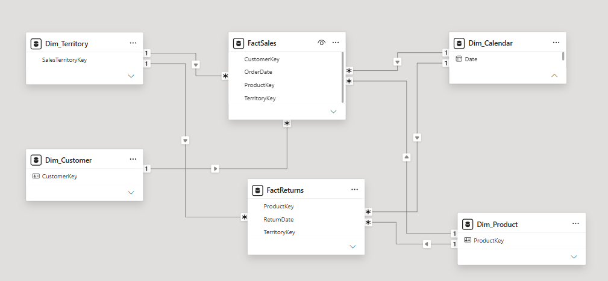
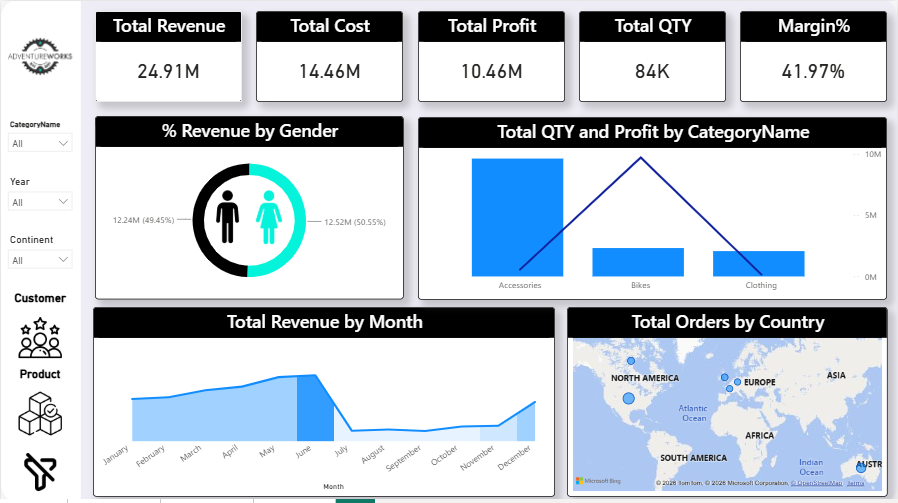
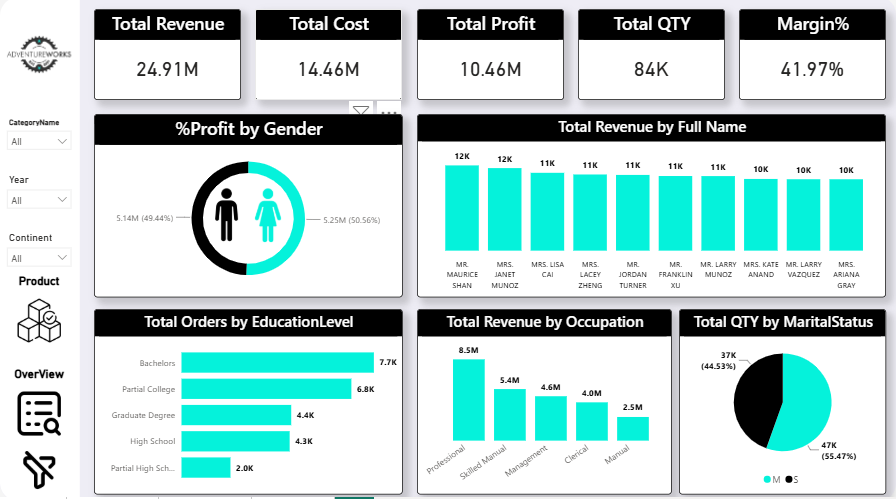
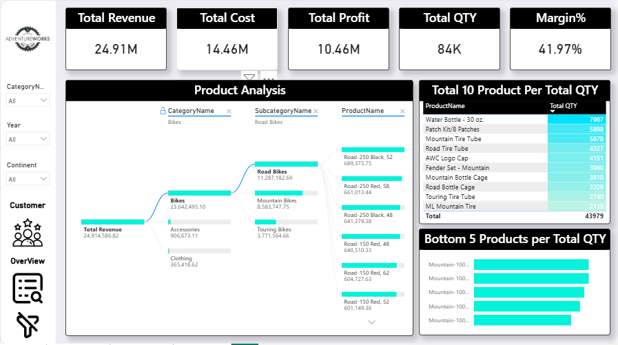

# AdventureWorks Sales & Returns Analysis

## 📌 Project Overview

This project presents an interactive Power BI dashboard built to analyze
sales performance, product performance, customer behavior, and returns
using AdventureWorks data covering the years 2020, 2021, and 2022.

The project focuses on transforming raw data into a structured analytical
model and extracting meaningful business insights through interactive
Power BI visualizations.

---

## 🗂️ Data Preparation & Transformation

The dataset initially contained sales data distributed across three
separate sheets representing the years 2020, 2021, and 2022.

The following transformations were performed using Power Query:

- Combined the three yearly Sales sheets into a single Sales fact table.
- Cleaned and prepared the data for analysis.
- Applied denormalization to the Product table by bringing Product Category
  and Subcategory information into the Product table.
- This reduced the number of relationships/joins required during analysis
  and helped simplify the analytical model and improve query performance.

---

## 🏗️ Data Modeling

The project uses a **Galaxy Schema** because the model contains two fact
tables:

- **Sales Fact Table**
- **Returns Fact Table**

These fact tables are connected to shared dimension tables such as:

- Customer
- Product
- Date
- Other relevant dimensions

The model was designed to support analysis from multiple business
perspectives while maintaining a clear separation between transactional
facts and descriptive dimensions.

##Modeling_Overview

---

## 📊 Key KPIs

The dashboard focuses on the following key performance indicators:

- **Total Revenue**
- **Total Cost**
- **Total Profit**
- **Total Quantity**
- **Profit Margin**

These KPIs provide an overall view of sales performance and profitability.

---

## 🔎 Analysis Perspectives

The analysis was divided into three main perspectives:

### 1. Overall Performance

Provides a high-level overview of the business performance, including
revenue, cost, profit, quantity, and margin.

### 2. Customer Analysis

Analyzes sales performance from the customer perspective, helping identify
customer purchasing behavior and the contribution of different customer
segments.

### 3. Product Analysis

Analyzes products and product categories to identify top-performing
products, categories, and other product-level trends.

---

## 🛠️ Tools & Technologies

- Power BI
- Power Query
- DAX
- Data Modeling
- Data Transformation
- AdventureWorks Dataset

---

## 📷 Dashboard Pages

### Sales Overview

### Customer Analysis

### Product Analysis

